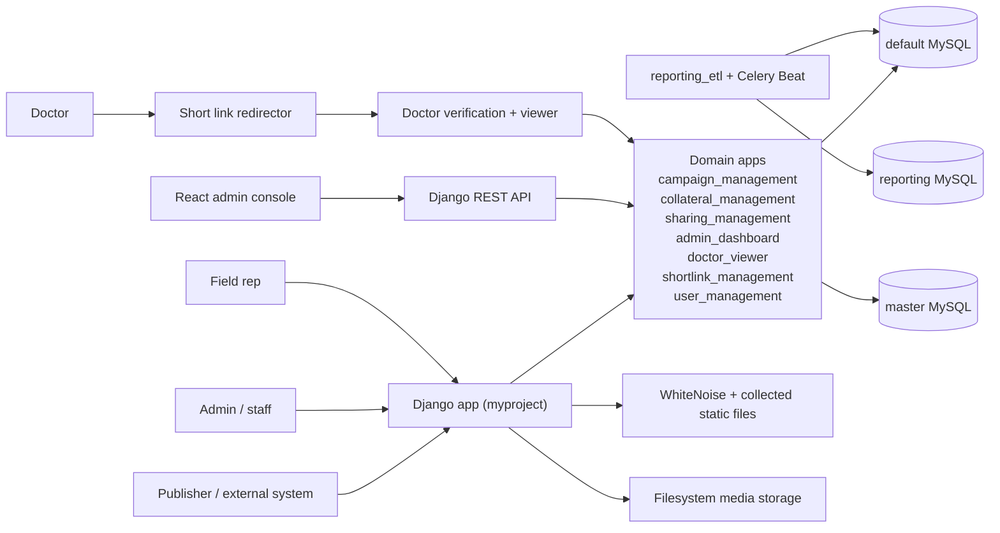
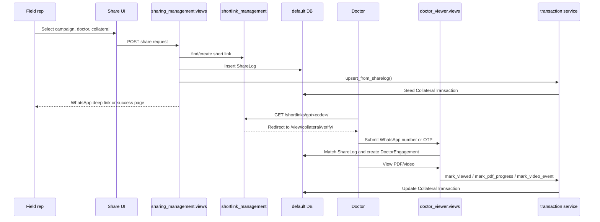
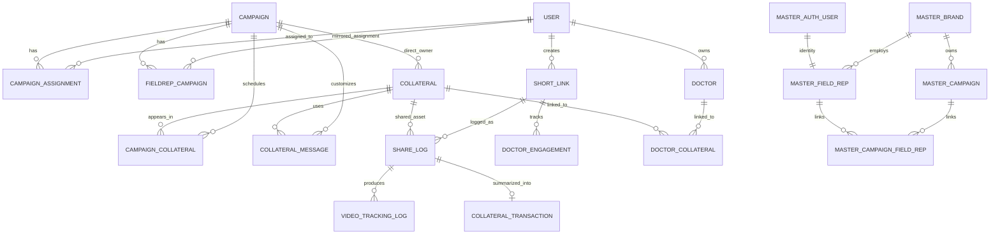

# InClinic Education System

This README is the consolidated technical reference for the repository. It replaces the fragmented notes in `server_arcitecture.md`, `flows/`, and the scaffolded frontend README with one implementation-grounded guide for:

- new developers joining the project
- maintainers debugging production behavior
- AI agents that need a reliable map of the system

The codebase is a Django multi-app monolith with a secondary Vite/React admin console, a three-database setup, and several compatibility layers that reconcile legacy schema behavior with the current product flows.

## Table of Contents

1. [Product Overview](#product-overview)
2. [System Architecture](#system-architecture)
3. [Codebase Structure](#codebase-structure)
4. [Core System Components](#core-system-components)
5. [Database Design](#database-design)
6. [Feature-Level Documentation](#feature-level-documentation)
7. [API and Service Layer](#api-and-service-layer)
8. [Application Flow](#application-flow)
9. [Developer Onboarding Guide](#developer-onboarding-guide)
10. [AI-Optimized System Summary](#ai-optimized-system-summary)

## Product Overview

### What the system does

InClinic is a campaign-driven collateral distribution and tracking platform for healthcare education. It allows internal teams and external publisher systems to:

- create and configure brand campaigns
- assign field representatives to campaigns
- upload PDF and Vimeo-based educational collateral
- generate short links for collateral delivery
- let field reps share materials with doctors over WhatsApp or email
- verify doctor access before content is unlocked
- capture PDF and video engagement
- aggregate sharing and engagement into transaction-style reporting records

### Problem it solves

The platform solves the operational gap between campaign planning and real doctor engagement:

- publishers need a controlled way to push campaign context into the education portal
- admins need to assign and manage field reps across brands and campaigns
- field reps need campaign-scoped collateral, prefilled messaging, and doctor lists
- doctors need a secure, low-friction way to access shared material
- reporting users need campaign-level engagement metrics, not just raw share logs

### Key features

- Publisher JWT entry flow for campaign-scoped landing pages
- Multi-database setup:
  - `default` operational portal database
  - `master` external source-of-truth database for campaigns, brands, and field reps
  - `reporting` analytics replica maintained by ETL
- Campaign management with read-only master data plus editable local metadata
- Collateral management for PDF, video, and PDF-plus-video assets
- Campaign-collateral calendar scheduling through bridge tables
- Custom WhatsApp message templates per campaign/collateral pair
- Field rep registration, password creation, login, forgot-password, and Gmail-based login paths
- Doctor sharing workflows with short links and verification
- PDF download, page-progress, and video-progress tracking
- Collateral transaction rollups for analytics dashboards
- Staff dashboard for field rep CRUD, doctor CRUD, and bulk CSV upload
- Optional React admin console intended to consume Django APIs

### Target users

| User | Goal | Main entry points |
| --- | --- | --- |
| Publisher / external system | Open a campaign inside the portal and maintain PE-specific fields | `/campaigns/publisher-landing-page/`, `/campaigns/publisher/<campaign_id>/edit/` |
| Internal admin / staff | Manage campaigns, field reps, collaterals, messages, and reports | Django admin, `/campaigns/manage-data/`, `/admin_dashboard/`, `/collaterals/` |
| Field representative | Register, login, manage doctors, and share collateral | `/share/fieldrep-*`, `/share/dashboard/` |
| Doctor | Verify access and consume the collateral | `/shortlinks/go/<code>/`, `/view/collateral/verify/`, `/view/<code>/` |
| Analytics stakeholder | Inspect campaign-level engagement and reporting data | `/reports/collateral-transactions/<brand_campaign_id>/`, reporting DB consumers |

### High-level user journey

1. A publisher or admin selects a brand campaign.
2. Campaign metadata is read from the master database and editable portal-specific fields are stored locally.
3. Internal teams upload collateral and optionally attach custom WhatsApp messages and campaign windows.
4. Admins assign field reps to a campaign in the master DB, while the portal mirrors enough data locally to keep doctor-sharing flows working.
5. A field rep logs in, sees only the collateral allowed for their assigned campaign, and shares it to a doctor.
6. The share creates a `ShortLink`, `ShareLog`, and a `CollateralTransaction` seed row.
7. The doctor clicks the short link, verifies access, views the asset, and generates `DoctorEngagement` plus tracking events.
8. Tracking services update the transaction rollup, and ETL replicates selected operational tables into the reporting database.

## System Architecture

### Overall architecture

The repository is best understood as a Django monolith with domain apps, thin service modules, and a defensive compatibility layer around an evolving schema.



### Application layers

| Layer | Primary files | Responsibilities |
| --- | --- | --- |
| Presentation | Django templates in each app, `backend/templates/`, `frontend/admin-console/src/` | Render staff, publisher, field-rep, and doctor UIs |
| Routing | `backend/myproject/urls.py`, app `urls.py` files | Expose HTML flows, REST routes, and public redirect/view paths |
| Controllers / views | `views.py`, `api_views.py`, `views_transactions_page.py` | Handle requests, orchestrate domain logic, return HTML/JSON/redirects |
| Forms and validation | `forms.py` in campaign, collateral, sharing, admin apps | Parse and validate multipart forms and CSV uploads |
| Services | `sharing_management/services/transactions.py`, `campaign_management/publisher_auth.py`, `reporting_etl/tasks.py` | Encapsulate cross-cutting business logic that should not live purely in views |
| Persistence | Django models, unmanaged master models, raw SQL helpers | Store portal state, read master data, maintain analytics replicas |
| Async / scheduled jobs | `backend/myproject/celery.py`, `reporting_etl/management/commands/run_etl.py` | Run ETL every 6 hours in the intended production design |

### Core components

| Component | Purpose | Key interactions |
| --- | --- | --- |
| `campaign_management` | Campaign lifecycle, publisher JWT entry, local campaign editing | Reads master campaign data, writes local `Campaign`, links reps and collaterals |
| `collateral_management` | Collateral CRUD, campaign linking, calendar windows, message templates | Writes `Collateral`, `CampaignCollateral`, `CollateralMessage` |
| `sharing_management` | Field rep auth and sharing flows, doctor uploads, share logs, transaction rollups | Writes `ShareLog`, `CollateralTransaction`, `VideoTrackingLog` |
| `doctor_viewer` | Doctor verification, asset rendering, engagement tracking | Reads `ShortLink` and `ShareLog`, writes `DoctorEngagement` |
| `shortlink_management` | Short link CRUD and public resolution | Redirects doctors into verification flow and increments click counts |
| `admin_dashboard` | Staff field rep and doctor management | Uses master DB for field reps and default DB for doctors |
| `api` | Session-authenticated DRF endpoints for campaigns, collaterals, shortlinks, shares, and engagements | Used by the React console and any session-backed integrations |
| `reporting_etl` | Incremental copy from operational DB to reporting DB | Uses `EtlState` plus raw SQL-safe cloning |

### Component interaction diagram



### Data flow

1. Master campaign or field rep data is read from the `master` DB.
2. The portal stores editable operational state in the `default` DB.
3. Public short links route doctors into `doctor_viewer`, which updates `DoctorEngagement`.
4. `sharing_management.services.transactions` converts share and engagement events into `CollateralTransaction` rows.
5. `reporting_etl` replicates selected operational tables into the `reporting` DB for BI consumers.

### Architectural patterns used

- Django MVT monolith split into business-domain apps
- Multi-database read/write segregation:
  - portal writes to `default`
  - master/reference reads from `master`
  - analytics copies into `reporting`
- Session-based authentication for staff and portal users
- JWT bootstrap only for publisher landing pages
- Service-layer rollups for transaction reporting
- Compatibility shims for legacy schema drift, especially around share logs and campaign IDs

### Important implementation notes

The following behaviors are present in code today and should be treated as intentional until refactored:

- `brand_campaign_id` is semantically an external campaign key, and the code treats it as either:
  - dashed UUID
  - dashless UUID
  - older branded string identifiers
- The operational collateral model is `collateral_management.Collateral`. A legacy `campaign_management.Collateral` model still exists and should be considered historical unless a specific code path proves otherwise.
- `ShareLog` and `CollateralTransaction` use `field_rep_id` as a raw integer master ID instead of a formal Django foreign key.
- Several doctor-view and reporting paths avoid broad ORM selects and use narrowed ORM reads or raw SQL because the model layer and database schema have drifted over time.
- The Django template UI is the authoritative operator interface. The React console exists, but some of its referenced endpoints are placeholders or do not currently match backend routes.
- Infrastructure files are not fully aligned with the active Django project:
  - `infrastructure/docker-compose.yml` and its Docker notes reference `adsync`, not `myproject`
  - `.github/workflows/deploy.yml` announces migrations but does not actually execute `python manage.py migrate`

## Codebase Structure

### Repository layout

```text
.
|-- backend/
|   |-- myproject/                  # Django project settings, root urls, WSGI/ASGI, Celery
|   |-- admin_dashboard/            # Staff dashboard for field reps and doctors
|   |-- api/                        # DRF serializers, viewsets, API router
|   |-- campaign_management/        # Campaign forms, views, publisher auth, master models
|   |-- collateral_management/      # Collateral CRUD, campaign linking, custom messages
|   |-- doctor_viewer/              # Doctor verification, view rendering, engagement logs
|   |-- reporting_etl/              # ETL state, Celery task, reporting sync command
|   |-- sharing_management/         # Field rep auth/share flows, transactions, bulk uploads
|   |-- shortlink_management/       # Short links and public redirect entry point
|   |-- user_management/            # Custom user model and security-related entities
|   |-- utils/                      # reCAPTCHA and template context helpers
|   |-- templates/                  # Shared templates and admin overrides
|   |-- media/                      # Checked-in sample/generated media artifacts
|   |-- staticfiles/                # Collected static output
|   `-- requirements.txt            # Python dependencies
|-- frontend/
|   `-- admin-console/              # React 19 + Vite + Tailwind admin console
|-- flows/                          # Older user-flow notes; now consolidated here
|-- infrastructure/                 # Dockerfiles, docker-compose, env examples
|-- .github/workflows/              # EC2 deployment workflow
|-- db.sqlite3                      # Repository artifact, not the main runtime DB
`-- django_project_export.txt       # Large exported code snapshot artifact
```

### Purpose of each major directory

| Path | Purpose |
| --- | --- |
| `backend/myproject/` | Root Django project, app registration, middleware, multi-DB settings, Celery bootstrap |
| `backend/campaign_management/` | Handles campaign CRUD, publisher landing flow, master DB campaign lookups |
| `backend/collateral_management/` | Stores collateral metadata/files and campaign-calendar associations |
| `backend/sharing_management/` | Largest business-flow app; owns field rep journeys, share logs, bulk uploads, transaction rollups |
| `backend/doctor_viewer/` | Public doctor-facing verification and engagement capture |
| `backend/admin_dashboard/` | Internal staff management UI for field reps and doctor lists |
| `backend/api/` | Thin DRF layer over key models |
| `backend/reporting_etl/` | Incremental replication into reporting DB |
| `backend/user_management/` | Custom user model plus security questions and OTP-related entities |
| `frontend/admin-console/` | Separate SPA for dashboards and uploads via session-backed API calls |
| `infrastructure/` | Container and deployment bootstrap assets, not fully current |

### Key modules and files

| File | Why it matters |
| --- | --- |
| `backend/myproject/settings.py` | Defines the active Django configuration, middleware, apps, and all three DB aliases |
| `backend/myproject/urls.py` | Global route map for the entire backend |
| `backend/campaign_management/master_models.py` | Read-only Django model proxies to the external master DB |
| `backend/campaign_management/publisher_auth.py` | Validates publisher JWTs and stores publisher sessions |
| `backend/sharing_management/views.py` | Core field rep registration, login, sharing, doctor upload, and dashboard logic |
| `backend/sharing_management/services/transactions.py` | Converts shares and engagement into `CollateralTransaction` rollups |
| `backend/doctor_viewer/views.py` | Doctor verification, viewer rendering, and engagement updates |
| `backend/reporting_etl/management/commands/run_etl.py` | Reporting replication engine |
| `frontend/admin-console/src/App.tsx` | React route map for the secondary admin console |

### Dependency relationships

- `campaign_management` depends on:
  - `user_management.User`
  - `campaign_management.master_models`
  - `admin_dashboard.FieldRepCampaign` during assignment mirroring
- `collateral_management` depends on:
  - `campaign_management.Campaign`
  - `user_management.User`
- `sharing_management` depends on:
  - `campaign_management` for campaigns and master field reps
  - `collateral_management` for collateral metadata and scheduling
  - `shortlink_management` for short link creation
  - `doctor_viewer` for doctor/engagement records
  - `user_management` for local portal users
- `doctor_viewer` depends on:
  - `shortlink_management`
  - `collateral_management`
  - `sharing_management.services.transactions`
- `admin_dashboard` bridges:
  - master field reps in `campaign_management.master_models`
  - portal users/doctors in `user_management` and `doctor_viewer`
- `api` exposes model data from `campaign_management`, `collateral_management`, `shortlink_management`, `sharing_management`, and `doctor_viewer`

## Core System Components

### Controllers / views

| Module | Purpose | Key logic | Main interactions |
| --- | --- | --- | --- |
| `campaign_management/views.py` | Campaign list/detail/create/update plus publisher entry | Normalizes campaign IDs, merges master snapshots with local campaign rows, keeps master-owned fields read-only | `MasterCampaign`, `MasterBrand`, `Campaign`, `CampaignAssignment`, `CampaignCollateral` |
| `collateral_management/views.py` | Collateral CRUD and campaign linking | Handles upload validation, auto-creates default WhatsApp message templates, supports replacement and preview | `Collateral`, `CampaignCollateral`, `CollateralMessage` |
| `sharing_management/views.py` | Field rep registration/login/share/dashboard | Resolves master-vs-portal identities, writes `ShareLog`, syncs assignments, filters collateral by campaign windows | `MasterFieldRep`, `Campaign`, `ShareLog`, `Doctor`, transaction service |
| `doctor_viewer/views.py` | Doctor-facing verification and content tracking | Validates short links, matches phone numbers, creates `DoctorEngagement`, updates transaction rollups | `ShortLink`, `ShareLog`, `DoctorEngagement`, transaction service |
| `admin_dashboard/views.py` | Staff management UI | Creates and updates master field reps, mirrors enough data locally for doctor pages, supports bulk uploads | `MasterAuthUser`, `MasterFieldRep`, `MasterCampaignFieldRep`, `User`, `Doctor` |
| `api/api_views.py` | JSON API | Exposes model CRUD/read-only endpoints with session auth and custom admin permission checks | DRF serializers, model viewsets |

### Services

| Service | Purpose | Responsibilities |
| --- | --- | --- |
| `campaign_management/publisher_auth.py` | Publisher SSO bridge | Extract JWT from header/query/body, validate issuer/audience/roles, create publisher session |
| `sharing_management/services/transactions.py` | Reporting rollup service | Backfill missing field-rep IDs, create/update `CollateralTransaction`, mark viewed/pdf/video milestones |
| `reporting_etl/tasks.py` + `run_etl.py` | Reporting sync | Periodically clone selected operational models from `default` to `reporting`, preserving ETL state |
| `shortlink_management/utils.py` | Utility helper | Generate random short codes |

### Modules

| Module | Responsibilities |
| --- | --- |
| `campaign_management` | Campaign entry, local edits, publisher flow, assignment helpers |
| `collateral_management` | Asset metadata, schedule windows, collateral message templates |
| `sharing_management` | Field rep auth, share orchestration, doctor CSV ingestion, analytics rollups |
| `doctor_viewer` | Doctor verification and asset engagement |
| `shortlink_management` | Public redirect and link inventory |
| `admin_dashboard` | Master field-rep management for staff users |
| `reporting_etl` | Analytics replication |
| `user_management` | Custom auth user plus security metadata |

### Utilities

| Utility | Purpose |
| --- | --- |
| `utils/recaptcha.py` | Decorator that enforces Google reCAPTCHA token validation on POST requests |
| `utils/context_processors.py` | Injects the reCAPTCHA site key into templates |
| `sharing_management/utils/db_operations.py` | Raw SQL helpers for OTP verification, WhatsApp verification, and download access |
| `sharing_management/views_transactions_page.py` | Campaign transaction dashboard built on top of `CollateralTransaction` |
| Ad hoc scripts in `backend/check_*.py` and `backend/link_*.py` | Manual debugging or one-off data correction scripts |

### Middleware and auth behavior

The active middleware stack in `settings.py` is:

- `SecurityMiddleware`
- `WhiteNoiseMiddleware`
- `CorsMiddleware`
- `SessionMiddleware`
- `CommonMiddleware`
- `CsrfViewMiddleware`
- `AuthenticationMiddleware`
- `MessageMiddleware`
- `XFrameOptionsMiddleware`
- `social_django.middleware.SocialAuthExceptionMiddleware`

Operationally, the system uses four auth modes:

- Django session auth for staff/admin users
- Django session auth for local portal field-rep flows
- master-DB credential validation for field-rep login and password reset
- JWT bootstrap for publisher landing pages

## Database Design

### Database topology

| Alias | Declared in code | Role | Notes |
| --- | --- | --- | --- |
| `default` | `settings.py` | Operational portal database | Campaigns, collaterals, shares, doctors, users, transaction rollups |
| `master` | `settings.py` | External source-of-truth database | Brands, campaigns, master field reps, master auth users |
| `reporting` | `settings.py` | Reporting/analytics database | Incremental ETL replica of selected portal tables |

### Operational data model (`default`)

| Entity | Purpose | Key relationships / constraints |
| --- | --- | --- |
| `user_management.User` | Custom portal user model with `role`, `field_id`, `phone_number`, Google auth ID | Used by local staff and portal field-rep flows |
| `campaign_management.Campaign` | Editable local campaign metadata keyed by `brand_campaign_id` | `brand_campaign_id` unique; linked to assignments and collaterals |
| `campaign_management.CampaignAssignment` | Local campaign-to-portal-user assignment | Unique on `(campaign, field_rep)` |
| `admin_dashboard.FieldRepCampaign` | Parallel local assignment mirror used by dashboard flows | Unique on `(field_rep, campaign)` |
| `collateral_management.Collateral` | Actual operational collateral object | Optional direct `campaign`, owner, file/video/banner metadata |
| `collateral_management.CampaignCollateral` | Schedule window bridge between campaign and collateral | Unique on `(campaign, collateral)` |
| `collateral_management.CollateralMessage` | Campaign-specific WhatsApp template per collateral | Unique on `(campaign, collateral)` |
| `shortlink_management.ShortLink` | Short code pointing to a collateral resource | `short_code` unique |
| `shortlink_management.DoctorVerificationOTP` | OTP record for doctor verification | FK to `ShortLink` |
| `doctor_viewer.Doctor` | Portal-side doctor list per local field rep | FK to local `User` |
| `doctor_viewer.DoctorEngagement` | Per-view engagement record for a short link | FK to `ShortLink` |
| `doctor_viewer.DoctorCollateral` | Unique doctor-to-collateral association | Unique on `(doctor, collateral)` |
| `sharing_management.ShareLog` | Event log for a share attempt | Stores `field_rep_id` as raw master ID plus doctor identifier and campaign key |
| `sharing_management.VideoTrackingLog` | Additional video milestone events per share | FK to `ShareLog` |
| `sharing_management.CollateralTransaction` | Analytics-friendly share + engagement rollup | Logical 1:1 with `ShareLog` via `sm_engagement_id` |
| `sharing_management.SecurityQuestion` | Security question lookup for field-rep password recovery | Referenced by `FieldRepSecurityProfile` |
| `sharing_management.FieldRepSecurityProfile` | Password-recovery profile mapped to master field-rep ID | `master_field_rep_id` unique |
| `user_management.SecurityQuestion` / `UserSecurityAnswer` | Older local security-answer entities | Still present in schema, but current reset flow relies on `sharing_management` versions |
| `reporting_etl.EtlState` | Per-model ETL cursor tracking | `model_name` unique |

### Master/reference data model (`master`)

These models are `managed = False` proxies. Django uses them for reads and targeted writes, but it does not own their schema.

| Entity | Table | Purpose |
| --- | --- | --- |
| `MasterBrand` | `campaign_brand` | Brand metadata |
| `MasterCampaign` | `campaign_campaign` | Source campaign metadata from the external publisher/master system |
| `MasterAuthUser` | `auth_user` | Master identity row for field reps |
| `MasterFieldRep` | `campaign_fieldrep` | Master field-rep row tied to a brand |
| `MasterCampaignFieldRep` | `campaign_campaignfieldrep` | Many-to-many campaign assignment link between master campaigns and master field reps |

### Relationships

- `Campaign` -> `CampaignAssignment` -> local `User`
- `Campaign` -> `CampaignCollateral` -> `Collateral`
- `Campaign` -> `CollateralMessage` -> `Collateral`
- `ShortLink` -> `ShareLog`
- `ShortLink` -> `DoctorEngagement`
- `ShareLog` -> `VideoTrackingLog`
- `ShareLog` -> `CollateralTransaction` (logical, via `sm_engagement_id`, not a formal FK)
- `MasterCampaign` -> `MasterCampaignFieldRep` -> `MasterFieldRep`
- `MasterBrand` -> `MasterCampaign`
- `MasterBrand` -> `MasterFieldRep`

### ER diagram



## Feature-Level Documentation

### 1. Publisher campaign intake and local campaign management

**Purpose**

Allow an external publisher system to open a campaign inside the portal, while keeping source campaign metadata in the master DB and storing only portal-specific campaign fields locally.

**User flow**

1. Publisher hits `/campaigns/publisher-landing-page/` with a JWT and a `campaign-id`.
2. `publisher_auth.py` validates the JWT and writes a publisher session.
3. `CampaignCreateView` or `CampaignUpdateView` resolves the campaign in the local DB.
4. Read-only fields such as brand, company, in-charge info, and doctor count are pulled from the master DB snapshot.
5. Editable portal fields such as dates, logos, printing config, contract, and login background image are saved in `campaign_management.Campaign`.

**Backend logic**

- `publisher_landing_page()` extracts JWT from header/query/body and strips it from the URL after validation.
- `CampaignCreateView` prevents duplicate local rows by redirecting to update if a campaign already exists.
- `CampaignUpdateView` only persists fields listed in `EDITABLE_FIELDS`.
- `manage_data_panel()` merges master campaigns with any existing local campaign rows for a side-by-side staff view.

**Data interactions**

- Reads: `MasterCampaign`, `MasterBrand`
- Writes: local `Campaign`
- Optional mirrors: `CampaignAssignment`, `FieldRepCampaign`

**Components involved**

- `campaign_management/views.py`
- `campaign_management/forms.py`
- `campaign_management/publisher_auth.py`
- `campaign_management/master_models.py`

### 2. Admin field-rep lifecycle management

**Purpose**

Let staff create, update, deactivate, bulk-upload, and campaign-assign field reps in the master DB, while preserving enough local user state for doctor and share flows.

**User flow**

1. Staff logs in through Django admin or `/admin/login/`.
2. `/admin_dashboard/fieldreps/` lists active reps, optionally filtered by campaign.
3. Staff can add/edit/delete master field reps or bulk-upload CSV rows.
4. When needed, the portal creates or updates a mirrored local `User` row so doctor pages still work.

**Backend logic**

- `FieldRepCreateView` and `FieldRepUpdateView` edit `MasterAuthUser` and `MasterFieldRep` inside transactions.
- `FieldRepDeleteView` performs a soft delete by toggling `is_active`.
- `bulk_upload_fieldreps()` still uses a local CSV form, then best-effort mirrors users into master tables and campaign links.
- `_ensure_portal_user_for_master_rep()` guarantees a local `User` exists for doctor ownership.

**Data interactions**

- Master writes: `MasterAuthUser`, `MasterFieldRep`, `MasterCampaignFieldRep`
- Local mirrors: `User`, `CampaignAssignment`, `FieldRepCampaign`, `Doctor`

**Components involved**

- `admin_dashboard/views.py`
- `admin_dashboard/forms.py`
- `campaign_management/master_models.py`

### 3. Collateral authoring, scheduling, and templating

**Purpose**

Store campaign-specific educational assets, control when they are visible to field reps, and define reusable WhatsApp message templates.

**User flow**

1. Staff uploads a collateral through `/collaterals/add/` or the CRUD views.
2. The collateral is linked to a campaign and optionally given a schedule window.
3. A default or custom WhatsApp template is created in `CollateralMessage`.
4. Field reps only see active collateral linked to their current campaign and valid for the current date.

**Backend logic**

- `CollateralForm` validates file size, PDF/video requirements, and Vimeo embed code parsing.
- `add_collateral_with_campaign()` creates the `Collateral`, auto-creates the default `CollateralMessage`, and inserts a `CampaignCollateral` link.
- `get_collaterals_by_campaign()` and `get_collateral_message()` drive message-template UI behavior.

**Data interactions**

- Writes: `Collateral`, `CampaignCollateral`, `CollateralMessage`
- Reads: `Campaign`

**Components involved**

- `collateral_management/views.py`
- `collateral_management/forms.py`
- `collateral_management/views_collateral_message.py`

### 4. Field-rep onboarding and authentication

**Purpose**

Support both traditional password login and Gmail-based identity matching for field reps assigned in the master system.

**User flow**

1. A rep receives a campaign-specific link.
2. New reps use `/share/fieldrep-register/` and `/share/fieldrep-create-password/`.
3. Existing reps use `/share/fieldrep-login/` or `/share/fieldrep-gmail-login/`.
4. After login, session keys capture field-rep identity and campaign context.

**Backend logic**

- `fieldrep_create_password()` registers the rep, stores security-question data, and best-effort creates a local portal user plus campaign assignment.
- `fieldrep_login()` validates password against `MasterFieldRep.password_hash` and falls back to the master `auth_user.password`.
- `fieldrep_forgot_password()` and `fieldrep_reset_password()` use `FieldRepSecurityProfile`.
- `fieldrep_gmail_login()` matches reps by field ID and Gmail ID, validates campaign assignment in the master DB, then creates or updates a portal user.

**Data interactions**

- Master reads/writes: `MasterAuthUser`, `MasterFieldRep`, `MasterCampaignFieldRep`
- Local writes: `User`, `FieldRepSecurityProfile`, `CampaignAssignment`, `FieldRepCampaign`

**Components involved**

- `sharing_management/views.py`
- `sharing_management/models.py`
- `campaign_management/master_models.py`

### 5. Field-rep collateral sharing and doctor management

**Purpose**

Give field reps a campaign-scoped list of shareable collateral and a doctor list they can grow manually or by CSV upload.

**User flow**

1. Rep opens `/share/fieldrep-share-collateral/<brand_campaign_id>/` or the Gmail variant.
2. The view filters collateral to only those assigned to the rep and valid for the current date.
3. The rep selects or creates a doctor and sends the WhatsApp message.
4. The system records the share and returns a WhatsApp deep link or success page.

**Backend logic**

- Share views resolve allowed campaigns from the master DB.
- `find_or_create_short_link()` is used to avoid recreating short links for the same collateral.
- A `ShareLog` row is written for each share.
- `upsert_from_sharelog()` seeds or updates a `CollateralTransaction`.
- `doctor_bulk_upload()` validates CSV rows against a specific campaign and its assigned field reps.

**Data interactions**

- Reads: `MasterCampaignFieldRep`, `CampaignCollateral`, `Collateral`, `Doctor`
- Writes: `ShortLink`, `ShareLog`, `CollateralTransaction`, `Doctor`

**Components involved**

- `sharing_management/views.py`
- `sharing_management/forms.py`
- `shortlink_management/models.py`
- `sharing_management/services/transactions.py`

### 6. Doctor verification and engagement tracking

**Purpose**

Prevent unauthorized access to collateral while collecting enough engagement telemetry for reporting.

**User flow**

1. Doctor clicks `/shortlinks/go/<code>/`.
2. The short link redirects to `/view/collateral/verify/?short_link_id=...`.
3. The doctor verifies access with a WhatsApp number or OTP.
4. The system unlocks the collateral and creates a `DoctorEngagement`.
5. Browser-side events post page-scroll, download, and video-progress updates.

**Backend logic**

- `resolve_shortlink()` increments click count and builds the verification redirect.
- `doctor_collateral_verify()` matches the entered number against `ShareLog.doctor_identifier`.
- `grant_download_access()` creates or updates a `DoctorEngagement` row.
- `log_engagement()` updates `DoctorEngagement` and then calls transaction service functions to keep `CollateralTransaction` in sync.

**Data interactions**

- Reads: `ShortLink`, `ShareLog`, `Collateral`
- Writes: `DoctorEngagement`, `CollateralTransaction`, `VideoTrackingLog`

**Components involved**

- `shortlink_management/views.py`
- `doctor_viewer/views.py`
- `sharing_management/utils/db_operations.py`
- `sharing_management/services/transactions.py`

### 7. Reporting and analytics

**Purpose**

Turn raw shares and engagement events into campaign-level dashboards and a reporting database suitable for BI tools.

**User flow**

1. Share flows create `ShareLog`.
2. Tracking flows update `DoctorEngagement` and `VideoTrackingLog`.
3. Transaction service functions merge those into `CollateralTransaction`.
4. ETL copies selected operational tables into the `reporting` DB.
5. Staff can open `/reports/collateral-transactions/<brand_campaign_id>/` for summarized operational reporting.

**Backend logic**

- `views_transactions_page.py` computes latest transaction rows per doctor/collateral/field-rep tuple and derives summary metrics.
- `run_etl` copies selected models from `default` to `reporting`, tracking watermarks in `EtlState`.
- Celery Beat is configured to run the ETL task every 6 hours.

**Data interactions**

- Operational analytics: `CollateralTransaction`
- ETL replica: `User`, `Campaign`, `Collateral`, `ShortLink`, `Doctor`, `ShareLog`, `DoctorEngagement`

**Components involved**

- `sharing_management/services/transactions.py`
- `sharing_management/views_transactions_page.py`
- `reporting_etl/tasks.py`
- `reporting_etl/management/commands/run_etl.py`

### 8. React admin console

**Purpose**

Provide a separate SPA under `/console` for dashboards and API-driven admin tasks.

**Current state**

- Technology: React 19, TypeScript, Vite, Tailwind, Axios, React Router 7
- Pages present:
  - dashboard
  - campaigns list
  - campaign detail
  - collateral upload
  - bulk field-rep upload
- Authentication model: Django session cookie via `axios` with `withCredentials: true`

**Current limitation**

The React console is not fully aligned with the backend:

- it expects `/admin/dashboard/json/`, `/api/campaigns/<id>/summary/`, and `/campaign-management/api/campaigns/`
- those routes are not defined in the checked-in Django URL configuration

Treat the React console as an in-progress or partial interface, not the definitive runtime UI.

## API and Service Layer

### Route families and authentication

| Route family | Primary auth mode |
| --- | --- |
| `/admin/*` | Django staff session |
| `/auth/*` | `social_django` routes and logout |
| `/campaigns/*` | Publisher JWT session or Django session depending on route |
| `/collaterals/*` | Mostly admin/staff session |
| `/share/*` | Field-rep session or local portal session |
| `/shortlinks/go/*`, `/view/*` | Public, but collateral access still requires verification |
| `/api/*` | Session auth, with admin role enforced on write-capable viewsets |

### Global and auth routes

| Path | Methods | Auth | Purpose | Request / response |
| --- | --- | --- | --- | --- |
| `/` | `GET` | Public | Landing page or redirect authenticated users to manage-data panel | HTML |
| `/admin/` | `GET`, `POST` and admin subroutes | Staff session | Django admin | HTML |
| `/admin/login/` | `GET`, `POST` | Public | Custom admin login that preserves campaign context in session | Form post, HTML redirect |
| `/auth/*` | Varies | Public / session | `social_django` OAuth endpoints | OAuth redirects and callbacks |
| `/auth/logout/` | `GET`, `POST` | Session | Logout | Redirect |
| `/user/profile/` | `GET` | Logged-in user | Return current user profile data | JSON `{username,email,role,active}` |

### Campaign routes

| Path | Methods | Auth | Purpose | Request / response |
| --- | --- | --- | --- | --- |
| `/campaigns/` | `GET` | Session | Campaign list | Query params: `brand_campaign_id`, `name`, `brand_name`, `status`; HTML |
| `/campaigns/manage-data/` | `GET` | Logged-in user | Side-by-side master/local campaign management panel | Query param: `q`; HTML |
| `/campaigns/create/` | `GET`, `POST` | Publisher session or logged-in user | Create a local campaign row for a master campaign | Form fields from `CampaignForm`, plus `campaign-id`; redirect |
| `/campaigns/<pk>/` | `GET` | Session | Legacy local campaign detail by PK | HTML |
| `/campaigns/<pk>/edit/` | `GET`, `POST` | Session | Legacy local campaign edit by PK | `CampaignForm`; redirect |
| `/campaigns/<pk>/delete/` | `GET`, `POST` | Session | Delete local campaign | Confirmation page / redirect |
| `/campaigns/campaign/<campaign_id>/` | `GET` | Session | Canonical detail by external campaign ID | HTML |
| `/campaigns/campaign/<campaign_id>/edit/` | `GET`, `POST` | Session | Canonical edit by external campaign ID | `CampaignForm`; redirect |
| `/campaigns/publisher/<campaign_id>/edit/` | `GET`, `POST` | Publisher session or session | Alias for publisher edit | Same as above |
| `/campaigns/publisher-landing-page/` | `GET`, `POST` | Public with valid JWT, then publisher session | Bootstrap publisher session and land on a campaign | Params: `jwt|token|access_token`, `campaign-id`; HTML or `401` |
| `/campaigns/publisher/select-campaign/` | `GET`, `POST` | Publisher session | Select a different publisher campaign | HTML / redirect |
| `/campaigns/thank-you/` | `GET` | Session | Campaign confirmation page | Query param: `campaign_id`; HTML |

### Collateral routes

| Path | Methods | Auth | Purpose | Request / response |
| --- | --- | --- | --- | --- |
| `/collaterals/` | `GET` | Session | Collateral list, optionally filtered by campaign | Query param: `campaign`; HTML |
| `/collaterals/create/` | `GET`, `POST` | Admin | Create collateral through generic CRUD view | `CollateralForm`; redirect |
| `/collaterals/add/` | `GET`, `POST` | Session | Combined add-collateral flow | Multipart `CollateralForm`, optional `whatsapp_message`; redirect |
| `/collaterals/add/<brand_campaign_id>/` | `GET`, `POST` | Session | Combined add-collateral flow scoped to a campaign | Same as above |
| `/collaterals/<pk>/` | `GET` | Session | Collateral detail | HTML |
| `/collaterals/<pk>/edit/` | `GET`, `POST` | Admin | Update collateral | `CollateralForm`; redirect |
| `/collaterals/<pk>/delete/` | `GET`, `POST` | Admin | Delete collateral | Confirmation page / redirect |
| `/collaterals/<pk>/replace/` | `GET`, `POST` | Session | Replace collateral files and metadata | Multipart replacement form; HTML |
| `/collaterals/<pk>/dashboard-delete/` | `POST` | Session | Delete collateral from dashboard flow | Redirect |
| `/collaterals/<pk>/preview/` | `GET` | Session | Render collateral preview using doctor-view template | HTML |
| `/collaterals/link/` | `GET`, `POST` | Admin | Link collateral to campaign with schedule window | `CampaignCollateralForm`; HTML / redirect |
| `/collaterals/unlink/<pk>/` | `GET`, `POST` | Session | Remove campaign-collateral bridge | Redirect |
| `/collaterals/calendar/edit/<pk>/` | `GET`, `POST` | Session | Edit bridge start/end dates | `CampaignCollateralDateForm`; HTML / redirect |
| `/collaterals/collateral-messages/` | `GET` | Logged-in user | List custom collateral messages | Query params: `brand_campaign_id`, `collateral_id`; HTML |
| `/collaterals/collateral-messages/create/` | `GET`, `POST` | Logged-in user | Create message template | `CollateralMessageForm`; HTML / redirect |
| `/collaterals/collateral-messages/<pk>/edit/` | `GET`, `POST` | Logged-in user | Edit message template | `CollateralMessageForm`; HTML / redirect |
| `/collaterals/collateral-messages/<pk>/delete/` | `GET`, `POST` | Logged-in user | Delete message template | HTML / redirect |
| `/collaterals/collateral-messages/get-collaterals/` | `GET` | Logged-in user | Return campaign-scoped active collaterals | Query param: `campaign_id`; JSON |
| `/collaterals/collateral-messages/get-message/` | `GET` | Logged-in user | Return active custom message for one campaign/collateral pair | Query params: `campaign_id`, `collateral_id`; JSON |

### Short-link and doctor-view routes

| Path | Methods | Auth | Purpose | Request / response |
| --- | --- | --- | --- | --- |
| `/shortlinks/` | `GET` | Session | Short-link list | HTML |
| `/shortlinks/create/` | `GET`, `POST` | Admin | Create short link for a collateral | `ShortLinkForm`; redirect |
| `/shortlinks/<pk>/` | `GET` | Session | Short-link detail | HTML |
| `/shortlinks/<pk>/delete/` | `GET`, `POST` | Admin | Delete short link | Confirmation page / redirect |
| `/shortlinks/go/<code>/` | `GET` | Public | Resolve a short code to doctor verification URL and increment click count | Optional `share_id|s|share`; redirect |
| `/shortlinks/debug/<code>/` | `GET` | Public | Return debug info for a short link | JSON |
| `/view/<code>/` | `GET` | Public | Render doctor viewer shell directly from short code | HTML |
| `/view/log/` | `POST` | Public | Update doctor engagement from browser events | JSON body with `event`, `engagement_id`, optional `value`, `page_number`, `pdf_total_pages`, `share_id`; JSON |
| `/view/report/<code>/` | `GET` | Public | Dump engagement report for a short code | JSON array |
| `/view/collateral/verify/` | `GET`, `POST` | Public | Verify doctor access by WhatsApp number and render unlocked collateral | Form fields: `whatsapp_number`, `short_link_id`; HTML |
| `/view/collateral/view/` | `POST` | Public | OTP-based doctor verification fallback | Form fields: `whatsapp_number`, `short_link_id`, `otp`; HTML |
| `/view/tracking-dashboard/` | `GET` | Public/session (no decorator present) | Aggregate doctor engagement dashboard | HTML |

### Field-rep sharing and dashboard routes

| Path | Methods | Auth | Purpose | Request / response |
| --- | --- | --- | --- | --- |
| `/share/share/` | `GET`, `POST` | `field_rep_required` local user | Generic share form for logged-in portal users | Form fields from `ShareForm`; HTML / redirect |
| `/share/share/success/<share_log_id>/` | `GET` | `field_rep_required` | Show share success page and WhatsApp link | HTML |
| `/share/logs/` | `GET` | `field_rep_required` | List share logs for the current field rep | Paginated HTML |
| `/share/fieldrep-register/` | `GET`, `POST` | Public | Email capture step before password creation | Query / form param: `campaign`; redirect |
| `/share/fieldrep-create-password/` | `GET`, `POST` | Public | Full registration form for new field rep | Email, field ID, names, WhatsApp, password, security question/answer; redirect |
| `/share/fieldrep-login/` | `GET`, `POST` | Public | Password-based field-rep login against master DB | Email, password, optional `campaign`; redirect |
| `/share/fieldrep-forgot-password/` | `GET`, `POST` | Public | Security-question driven forgot-password flow | Email, answer; HTML / redirect |
| `/share/fieldrep-reset-password/` | `GET`, `POST` | Public | Reset master and portal password | Email, password, confirm password; redirect |
| `/share/fieldrep-share-collateral/` | `GET`, `POST` | Field-rep session | Main share UI using session campaign or all assigned campaigns | HTML or AJAX JSON |
| `/share/fieldrep-share-collateral/<brand_campaign_id>/` | `GET`, `POST` | Field-rep session | Campaign-scoped share UI | HTML or AJAX JSON |
| `/share/fieldrep-gmail-login/` | `GET`, `POST` | Public | Match field rep by field ID + Gmail ID | Form fields: `field_id`, `gmail_id`, optional `brand_campaign_id`; redirect |
| `/share/fieldrep-gmail-share-collateral/` | `GET`, `POST` | Field-rep session | Gmail-login share UI | HTML or redirect/AJAX depending on form |
| `/share/fieldrep-gmail-share-collateral/<brand_campaign_id>/` | `GET`, `POST` | Field-rep session | Campaign-scoped Gmail-login share UI | HTML |
| `/share/dashboard/` | `GET` | `field_rep_required` | Field-rep collateral dashboard | Query params: `campaign`, `search`; HTML |
| `/share/dashboard/campaign/<campaign_id>/` | `GET` | `field_rep_required` | Legacy campaign-detail engagement page by local campaign PK | HTML |
| `/share/dashboard/doctors/` | `GET` | Session | Doctor list with current collateral status | Query param: `collateral`; HTML |
| `/share/dashboard/doctors/bulk-upload/` | `GET`, `POST` | `field_rep_required` | CSV upload of doctors scoped to a campaign | Multipart CSV upload; HTML |
| `/share/dashboard/doctors/bulk-upload/sample/` | `GET` | `field_rep_required` | Download sample doctor CSV | CSV response |
| `/share/dashboard/campaign/<campaign_id>/doctors/` | `GET` | Session | Alias to doctor list scoped to legacy campaign assignment | HTML |
| `/share/dashboard/collateral/<pk>/delete/` | `POST` | `field_rep_required` | Soft-delete collateral from field-rep dashboard | Redirect |
| `/share/collaterals/edit/<pk>/` | `GET`, `POST` | Session | Edit collateral through sharing module helper | HTML |
| `/share/edit-calendar/` | `GET`, `POST` | Session | Manage campaign-collateral calendar rows | HTML or AJAX JSON |
| `/share/video-tracking/` | `POST` | Public/session | Insert video milestone row and update transaction rollup | Form fields: `collateral_sharing`, `userId`, `status`; JSON |
| `/share/debug-collaterals/` | `GET` | Public/session | Debug HTML for current collaterals and users | HTML |

### Admin dashboard routes

| Path | Methods | Auth | Purpose | Request / response |
| --- | --- | --- | --- | --- |
| `/admin_dashboard/` | `GET` | Staff session | Redirect to field-rep list, preserving campaign filter from session | Redirect |
| `/admin_dashboard/bulk-fieldreps/` | `GET`, `POST` | Staff session + reCAPTCHA on POST | Bulk upload field reps | Multipart CSV upload; HTML / redirect |
| `/admin_dashboard/fieldreps/` | `GET` | Staff session | List active master field reps | Query params: `q`, `campaign_id`, `campaign`, `brand_campaign_id`; HTML |
| `/admin_dashboard/fieldreps/add/` | `GET`, `POST` | Staff session | Create master field rep | `MasterFieldRepForm`; HTML / redirect |
| `/admin_dashboard/fieldreps/<pk>/edit/` | `GET`, `POST` | Staff session | Update master field rep | `MasterFieldRepForm`; HTML / redirect |
| `/admin_dashboard/fieldreps/<pk>/delete/` | `GET`, `POST` | Staff session | Soft-delete master field rep | HTML / redirect |
| `/admin_dashboard/fieldreps/<pk>/doctors/` | `GET`, `POST` | Staff session | List and create doctors for a master field rep via mirrored local user | `DoctorForm`; HTML |
| `/admin_dashboard/fieldreps/<rep_id>/doctors/` | `GET`, `POST` | Staff session | Legacy alias for the same doctor page | HTML |
| `/admin_dashboard/fieldreps/<pk_rep>/doctors/<pk>/edit/` | `GET`, `POST` | Staff session | Edit doctor | `DoctorForm`; HTML / redirect |
| `/admin_dashboard/fieldreps/<pk_rep>/doctors/<pk>/delete/` | `GET`, `POST` | Staff session | Delete doctor | HTML / redirect |
| `/reports/collateral-transactions/<brand_campaign_id>/` | `GET` | Session | Campaign-scoped transaction report page | Query param: `collateral_id`; HTML |

### REST API routes

All API routes live under `/api/` and use Django session authentication.

| Path | Methods | Auth | Purpose | Request / response |
| --- | --- | --- | --- | --- |
| `/api/get-collateral-campaign/<collateral_id>/` | `GET` | Authenticated session | Return campaign ID and dates for a collateral | JSON `{success, brand_campaign_id, start_date, end_date}` |
| `/api/campaigns/` | `GET`, `POST` | Admin role for writes | List or create campaigns | Serializer fields = `Campaign.__all__` |
| `/api/campaigns/<id>/` | `GET`, `PUT`, `PATCH`, `DELETE` | Admin role for writes | Retrieve/update/delete one campaign | JSON serializer payload |
| `/api/collaterals/` | `GET`, `POST` | Admin role for writes | List or create collaterals | Serializer fields = `Collateral.__all__` |
| `/api/collaterals/<id>/` | `GET`, `PUT`, `PATCH`, `DELETE` | Admin role for writes | Retrieve/update/delete one collateral | JSON serializer payload |
| `/api/shortlinks/` | `GET`, `POST` | Admin role for writes | List or create short links | Serializer fields = `ShortLink.__all__` |
| `/api/shortlinks/<id>/` | `GET`, `PUT`, `PATCH`, `DELETE` | Admin role for writes | Retrieve/update/delete one short link | JSON serializer payload |
| `/api/shares/` | `GET` | Authenticated session | Read-only share logs | Serializer fields = `ShareLog.__all__`; field reps are intended to see their own rows, although this path may need review because the filter still references an older FK shape |
| `/api/shares/<id>/` | `GET` | Authenticated session | Read one share log | JSON |
| `/api/engagements/` | `GET` | Authenticated session | Read-only doctor engagements | Serializer fields = `DoctorEngagement.__all__` |
| `/api/engagements/<id>/` | `GET` | Authenticated session | Read one doctor engagement | JSON |

## Application Flow

### Flow 1: Publisher to local campaign edit

1. User opens publisher URL.
2. UI entry: `/campaigns/publisher-landing-page/`.
3. Controller: `publisher_landing_page()`.
4. Auth service: `extract_jwt_from_request()` and `validate_publisher_jwt()`.
5. Session state: `establish_publisher_session()`.
6. Database reads:
   - `MasterCampaign`
   - `MasterBrand`
7. Controller: `CampaignCreateView` or `CampaignUpdateView`.
8. Database writes: local `Campaign`.
9. Response: redirect to canonical campaign edit page with master fields shown read-only.

### Flow 2: Field rep share to doctor view

1. User: field rep.
2. UI: `/share/fieldrep-share-collateral/<brand_campaign_id>/`.
3. Controller: `fieldrep_share_collateral()`.
4. Database reads:
   - `MasterFieldRep`
   - `MasterCampaignFieldRep`
   - `CampaignCollateral`
   - `Collateral`
   - `Doctor`
5. Utility: create or reuse `ShortLink`.
6. Database writes:
   - `ShareLog`
   - `CollateralTransaction` via `upsert_from_sharelog()`
7. Response:
   - AJAX JSON with `whatsapp_url`
   - or redirect to WhatsApp / success page
8. Doctor clicks `/shortlinks/go/<code>/`.
9. Controller chain:
   - `resolve_shortlink()`
   - `doctor_collateral_verify()`
10. Database writes:
    - `DoctorEngagement`
    - `CollateralTransaction` updates through tracking service calls
11. UI result: doctor viewer renders the PDF/video plus archives.

### Flow 3: Engagement tracking

1. Doctor UI emits browser event.
2. API endpoint: `/view/log/`.
3. Controller: `doctor_viewer.log_engagement()`.
4. Database update: `DoctorEngagement`.
5. Service calls:
   - `mark_viewed()`
   - `mark_pdf_progress()`
   - `mark_downloaded_pdf()`
   - `mark_video_event()`
6. Rollup target: `CollateralTransaction`.
7. Response: JSON `{ok: true, event: ...}`.

### Flow 4: Operational DB to reporting DB

1. Scheduler triggers Celery Beat entry in `myproject/celery.py`.
2. Task: `reporting_etl.tasks.scheduled_etl`.
3. Command: `python manage.py run_etl`.
4. ETL cursor: `EtlState`.
5. Models copied:
   - `User`
   - `Campaign`
   - `Collateral`
   - `ShortLink`
   - `Doctor`
   - `ShareLog`
   - `DoctorEngagement`
6. Target: `reporting` DB.

## Developer Onboarding Guide

### Tech stack

| Layer | Stack |
| --- | --- |
| Backend | Python 3.11, Django 4.2, Django REST Framework |
| Frontend | React 19, TypeScript, Vite 6, Tailwind CSS |
| Databases | MySQL for `default`, `master`, and `reporting` |
| Async | Celery 5, Redis |
| Auth / integrations | `social-auth-app-django`, Google OAuth, reCAPTCHA, SMTP email |
| Asset processing | PyMuPDF, PyPDF2, `pdf2image` |

### Required tools

- Python 3.11+
- Node.js 20+
- npm 10+
- MySQL 8
- Redis 7 (if running Celery)
- system packages required by Python dependencies:
  - MySQL client headers for `mysqlclient`
  - Poppler for `pdf2image`

### Configuration reality

The checked-in `backend/myproject/settings.py` is deployment-oriented. It currently:

- loads environment variables from `/var/www/secrets/.env`
- hardcodes the three MySQL aliases instead of deriving them fully from environment variables
- expects production filesystem paths such as:
  - `/var/www/inclinic-education-system/frontend/admin-console/dist`
  - `/var/www/inclinic-media`

For local development, the practical approach is to use the repo as the source of truth for behavior, but create a non-committed local settings module or environment-specific override that points to local paths and databases.

### Environment variables used by the code

| Variable | Used by | Purpose |
| --- | --- | --- |
| `SECRET_KEY` | Django settings | Secret key fallback override |
| `SOCIAL_AUTH_GOOGLE_OAUTH2_KEY` | `social_django` | Google OAuth client ID |
| `SOCIAL_AUTH_GOOGLE_OAUTH2_SECRET` | `social_django` | Google OAuth client secret |
| `RECAPTCHA_SITE_KEY` | templates / context processor | Frontend reCAPTCHA key |
| `RECAPTCHA_SECRET_KEY` | `utils/recaptcha.py` | Server-side reCAPTCHA verification |
| `EMAIL_HOST_USER` | Django email backend | SMTP username |
| `EMAIL_HOST_PASSWORD` | Django email backend | SMTP app password |
| `PUBLISHER_JWT_SECRET` | publisher auth | HS256 publisher token validation |
| `PUBLISHER_JWT_PUBLIC_KEY` | publisher auth | Asymmetric publisher token validation |

The container files additionally define `MYSQL_*`, `DB_HOST`, `DB_PORT`, `CELERY_BROKER_URL`, and `VITE_BACKEND_URL`, but the checked-in Django settings do not currently consume those database env vars directly.

### Recommended local setup

1. Create the Python environment:

```bash
cd backend
python3 -m venv .venv
source .venv/bin/activate
pip install -r requirements.txt
```

2. Provision MySQL databases that match the code assumptions:

- `myproject_dev` for `default`
- `myproject_reporting` for `reporting`
- access to the external `master` DB if you need publisher or master field-rep flows

3. Create local configuration overrides:

- use a non-committed local settings module, or
- temporarily adjust `backend/myproject/settings.py` for local DB and media/static paths

4. Apply migrations to the operational DB:

```bash
cd backend
python manage.py migrate
```

5. Populate baseline security questions if needed:

```bash
python manage.py create_security_questions
```

6. Start the backend:

```bash
python manage.py runserver
```

### Frontend setup

```bash
cd frontend/admin-console
npm install
npm run dev
```

Important notes:

- The React app uses `VITE_BACKEND_URL` and defaults to `https://new.cpdinclinic.co.in`.
- It expects a Django session cookie and CSRF cookie.
- Some API paths referenced by the SPA are not implemented in the current backend, so the template-driven Django UI is the safer default for local QA.

### Running Celery and ETL

Start Redis, then run:

```bash
cd backend
source .venv/bin/activate
celery -A myproject worker -l info
celery -A myproject beat -l info
```

Manual ETL:

```bash
python manage.py run_etl
python manage.py run_etl --full-refresh
```

### Build and production steps

Frontend build:

```bash
cd frontend/admin-console
npm run build
```

Backend static collection:

```bash
cd backend
python manage.py collectstatic --noinput
```

WSGI entry point:

- `backend/myproject/wsgi.py`

ASGI entry point:

- `backend/myproject/asgi.py`

### Deployment and infrastructure notes

- GitHub Actions workflow: `.github/workflows/deploy.yml`
- Current behavior:
  - SSH into EC2
  - `git fetch` and hard reset to `origin/main`
  - install backend dependencies
  - run `collectstatic`
  - restart Gunicorn and Nginx
- Caveat: the workflow prints "Running migrations..." but does not actually run migrations.
- Docker assets exist in `infrastructure/`, but `docker-compose.yml` references `adsync` settings and Gunicorn targets that do not match the active Django project name (`myproject`).

### Testing status

The repository contains test files for each Django app, but they are mostly placeholders with minimal or no test coverage. Expect manual verification to be necessary for any behavior changes, especially around:

- publisher JWT flows
- master/local ID reconciliation
- share-log to transaction rollups
- doctor verification and engagement tracking

## AI-Optimized System Summary

### Architecture

- Primary runtime: Django monolith in `backend/`
- Secondary runtime: React/Vite admin console in `frontend/admin-console/`
- Databases:
  - `default` operational portal data
  - `master` source campaigns / brands / field reps
  - `reporting` ETL destination
- Async: Celery Beat schedules reporting ETL every 6 hours

### Core modules

- `campaign_management`: campaign CRUD, publisher entry, master campaign snapshots
- `collateral_management`: asset model, campaign scheduling, custom message templates
- `sharing_management`: field-rep journeys, share logs, bulk uploads, transaction rollups
- `doctor_viewer`: doctor verification and engagement capture
- `shortlink_management`: short code creation and public redirect
- `admin_dashboard`: master field-rep CRUD and doctor management
- `reporting_etl`: analytics replication

### Key services

- `publisher_auth.py`: validates publisher JWTs and creates publisher sessions
- `services/transactions.py`: upserts `CollateralTransaction` from shares and engagement
- `run_etl.py`: replicates selected portal tables to the reporting DB
- `utils/recaptcha.py`: POST request gatekeeper for forms that require bot protection

### Data model in one paragraph

Campaigns originate in the master DB, but the portal stores editable campaign metadata locally. Collateral is managed in the local DB and connected to campaigns through a bridge table with optional scheduling windows. Sharing a collateral creates or reuses a short link, logs the share in `ShareLog`, and seeds `CollateralTransaction`. Doctor verification and view events create `DoctorEngagement` and optional `VideoTrackingLog` rows, while the transaction service keeps the rollup table synchronized for reporting.

### Main flows

- Publisher flow: JWT -> publisher session -> local campaign create/update
- Staff flow: create master field rep -> optionally mirror to local user -> assign campaign
- Field-rep flow: login -> load campaign-eligible collateral -> share to doctor -> create `ShareLog`
- Doctor flow: short link -> verify phone/OTP -> view collateral -> emit engagement events
- Reporting flow: share/engagement updates -> `CollateralTransaction` -> ETL to reporting DB

### Read this first if you are modifying the system

1. `backend/myproject/settings.py`
2. `backend/myproject/urls.py`
3. `backend/campaign_management/views.py`
4. `backend/sharing_management/views.py`
5. `backend/sharing_management/services/transactions.py`
6. `backend/doctor_viewer/views.py`
7. `backend/campaign_management/master_models.py`

### Biggest maintenance risks

- Schema drift between Django models and the actual database tables
- Mixed use of local portal user IDs, master auth-user IDs, and master field-rep IDs
- Duplicate or legacy models and utilities that still exist for compatibility
- Infra configs that are partially stale relative to the active Django project
