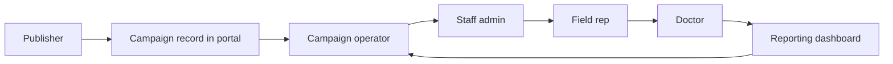

# Platform Overview and Role Map

## 1. Title

Platform Overview and Role Map

## 2. Document Purpose

Explain how campaign master data, portal operations, field-rep sharing, doctor verification, and reporting connect end to end.

## 3. Primary User

New team members, trainers, implementation partners, and AI agents orienting to the product.

## 4. Entry Point

Role-dependent. The seeded demo uses `/campaigns/manage-data/`, `/campaigns/publisher-landing-page/`, `/share/fieldrep-gmail-login/`, and `/shortlinks/go/<code>/` as the main route families.

## 5. Workflow Summary

- Campaign definitions originate in the master database and are surfaced in the portal through the Manage Data Panel and publisher landing pages.
- Editable campaign metadata, collateral assets, share logs, and transaction rollups live in the portal database.
- Field reps now reach the campaign share flow primarily through the Gmail/manual login or signed SSO entry point; legacy register and create-password URLs redirect into that path.
- Doctors unlock collateral with the same WhatsApp number used during sharing, then consume PDF/video content in a viewer that also surfaces archive and webinar follow-ons.
- Reporting screens summarize the latest engagement state per doctor, per collateral, per campaign.

### Role Map

| Role | Core screens | Output to the next role |
| --- | --- | --- |
| Publisher / partner system | Publisher landing page, campaign update form | Brand-campaign context plus editable campaign metadata |
| Internal campaign operator | Manage Data Panel, campaign detail/update | Access to field-rep and collateral operations |
| Staff admin | Field rep list, doctor maintenance | Campaign-assigned reps and doctor rosters |
| Field rep | Gmail/manual login, share collateral page, doctor bulk upload | WhatsApp messages containing short links |
| Doctor | Verify access page, collateral viewer, support chatbot | Engagement records, archive opens, webinar opens |
| Reporting stakeholder | Collateral transactions dashboard | Operational follow-up and campaign insight |

### Role Flow Diagram

### Where Each Workflow Starts

| Workflow | Typical starter |
| --- | --- |
| Publisher campaign onboarding | Signed publisher link with `campaign-id` and JWT |
| Campaign operations | Authenticated portal login -> Manage Data Panel |
| Field rep administration | Authenticated portal login -> Field Rep list |
| Collateral authoring | Campaign shortcut into the collateral dashboard |
| Field rep sharing | Campaign-scoped Gmail/manual login or signed SSO route |
| Doctor consumption | Public short link from WhatsApp |
| Reporting review | Campaign report URL with `brand_campaign_id` |

> Legacy note: `/share/fieldrep-register/` and `/share/fieldrep-create-password/` remain available only as compatibility redirects into the Gmail/manual login screen.

## 6. Step-By-Step Instructions

### Step 1. Identify the role-specific entry point

- What the user does: Start from the route that matches the role: publisher link, authenticated Manage Data Panel, field-rep login page, or public short link.
- What the user sees: A role-appropriate screen with the campaign context already embedded or selected.
- Why the step matters: The system is intentionally route-driven. The entry point determines which database data is consulted and which actions are available next.
- Expected result: The user lands on the correct role surface without manually stitching together URLs.
- Common issues / trainer notes: Call out that the codebase has separate routes for publisher, staff, field-rep, and doctor experiences rather than a single unified shell.
- Screenshot placeholder:
  Suggested file path: `docs/product-user-flows/assets/platform-overview-and-role-map/platform-home.png`
  Screenshot caption: Public home page used before an authenticated or signed route is chosen.
  What the screenshot should show: The simple unauthenticated landing page that redirects authenticated users into campaign operations.

### Step 2. Move campaign context from master data into portal operations

- What the user does: Open the Manage Data Panel or the publisher flow for a specific brand campaign.
- What the user sees: A campaign inventory or campaign form populated with master-owned context such as brand name, company name, and doctor count.
- Why the step matters: This is the handoff from source-of-truth campaign definitions into the operational portal where the team can manage assets and distribution.
- Expected result: The campaign is recognizable and ready for collateral, rep, and doctor operations.
- Common issues / trainer notes: Master values are shown read-only in the campaign update flow; only PE-side fields are meant to be edited locally.
- Screenshot placeholder:
  Suggested file path: `docs/product-user-flows/assets/platform-overview-and-role-map/platform-manage-data.png`
  Screenshot caption: Manage Data Panel with campaign shortcuts into field-rep and collateral operations.
  What the screenshot should show: The main operational hub that ties campaigns to downstream workflows.

### Step 3. Distribute collateral through campaign-assigned field reps

- What the user does: Assign or confirm field reps, then let a field rep authenticate into the Gmail/manual share flow or signed SSO entry point and send a doctor-facing WhatsApp message.
- What the user sees: Campaign-specific collateral options, doctor lists, send/reminder statuses, and the floating support chatbot on the field-rep pages.
- Why the step matters: This is the commercial and educational delivery loop the platform is built to support.
- Expected result: A doctor receives a short link tied back to the right collateral, campaign, and rep.
- Common issues / trainer notes: The operator-facing campaign screens and the field-rep share screens live in different route families but reference the same campaign ID. Legacy register/create-password links now resolve into this same handoff.
- Screenshot placeholder:
  Suggested file path: `docs/product-user-flows/assets/platform-overview-and-role-map/platform-share-handoff.png`
  Screenshot caption: Field-rep share page showing the current campaign form, doctor list, and support chatbot entry point.
  What the screenshot should show: The moment where campaign operations become doctor outreach in the current Gmail-first flow.

### Step 4. Close the loop with doctor verification and reporting

- What the user does: Follow the doctor from short-link click to verification, then open the transaction dashboard for the same campaign.
- What the user sees: The doctor unlock screen, the collateral viewer with PDF/archive/webinar content and support chatbot, and a reporting dashboard summarizing doctor-level outcomes.
- Why the step matters: The product is not just a file host; it exists to connect campaign setup to verifiable doctor engagement.
- Expected result: Doctor actions are visible again in reporting and can drive follow-up conversations.
- Common issues / trainer notes: Point out that the transaction dashboard shows the latest state per doctor and collateral rather than every raw event row.
- Screenshot placeholder:
  Suggested file path: `docs/product-user-flows/assets/platform-overview-and-role-map/platform-reporting-loop.png`
  Screenshot caption: Reporting dashboard that reflects the downstream result of shares and doctor engagement.
  What the screenshot should show: The closed feedback loop from campaign setup to doctor behavior.

## 7. Success Criteria

- A new user can explain which role owns which screen family.
- The relationship between master data, portal edits, sharing, verification, and reporting is clear.
- The team knows where to start each downstream workflow without guessing routes.

## 8. Related Documents

- `README.md`
- `docs/product-user-flows/02-publisher-campaign-onboarding-and-update.md`
- `docs/product-user-flows/07-field-rep-sharing-and-doctor-bulk-upload.md`
- `docs/product-user-flows/09-engagement-reporting-and-transaction-review.md`

## 9. Status

Validated against the seeded docs demo and the current Django route map on 2026-04-23.
